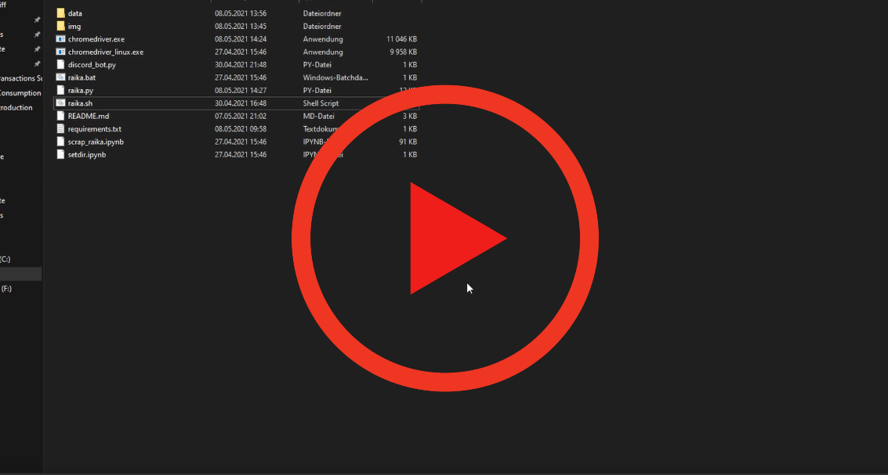

# Automating Raiffeisenbank Login and Data Gathering for Monthly Expenses

---
## Table of contents
* [General info](#general-info)
* [Setup](#setup)
* [Example](#example)

---
## General info
Simple Python File for keeping track of your monthly Expenses. Currently only available for Styria.
The current [chromedriver.exe](https://chromedriver.chromium.org/downloads) file in the folder where the *.py files are saved is mandatory in order to do the Webscraping.

---
## Setup
Run the [raika.py](setup/raika.py) file in your terminal (cmd/bash).
1.	It will ask for password and "Verfügernummer" for login and the download folder location in order to get the downloaded data. Data is stored as a .pickle file (not readable for humans) under the data folder. Also if you want to automate scraping every month you can set up a discord bot (enter your discord key) to get the get the pin for confirmation.
2.  After the "initialization" you have two options for storing the data:
	1. If you want to automatic download the current month as a csv file and store the data option 1 is the right choice.
	2. If you have downloaded a csv file which you want to be processed and saved option 2 is the right choice.
3.  If you have saved data with option 1 or option 2 you can access (plot) the data in one of the following ways:
   1. If you want to see an interactive plot with expenses grouped by company chooce option 3.
   2. If you want to see an interactive plot with expenses grouped by date chooce option 4.
   3. If you want to see the saved dataframe chooce option 5.

---
## Example

